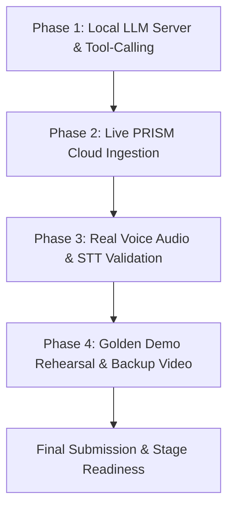

# ClaimGuard — Remaining Tasks & Execution Plan
**Canonical Reference:** `Overall-plan.md` | **Team Brief:** `HANDOVER.md`  
**Target:** ForgeAI Hackathon · graVITas'26 · VIT Vellore  
**Core Thesis:** *PRISM is the hero, ClaimGuard is the vehicle. The LLM proposes; deterministic code disposes.*

---

## 1. Status Overview

| Subsystem | Owner | Current State | Remaining Needs |
|---|---|---|---|
| **L0/L6 Console & Edge** | Ojas | Done (`frontend/` + `/console`) | Demo rehearsal, backup screencast |
| **L1 Perception & Security** | Ojas | Done (`pii_shield.py`, transcriber stub) | Real audio clips (.wav), live Whisper STT check |
| **L2 Cognition & RAG** | Ali | Done (`app/agent/`, `app/rag/`) | Live local LLM server test (`use_mock=False`) |
| **L3 Enforcement** | Ali | Done (Commit Window, Latch, Veto) | Verified against live model tool output |
| **L4 System of Record** | Ali | Done (`claimguard.db` + triggers) | Verified in end-to-end flow |
| **L5 PRISM Observability** | Pratham | Tracer implemented, traces logged locally | 3-call smoke test, 98-credit budget run, screenshots |
| **Evals & Benchmark** | Pratham | Done (60-call replay set, checker, results) | None (pre-registered & scored) |
| **Presentation & Pitch** | Team | Done (`claimguard-pitch.html` & `.pdf`) | PRISM UI screenshots, live demo rehearsal |

---

## 2. Step-by-Step Execution Plan

---

### Phase 1: Local Model Server & Tool-Calling Validation (Ali / P1)
**Objective:** Confirm that the small local LLM (or LiteLLM proxy fallback) reliably handles tool calls without crashing the server or failing JSON parsing.

- [ ] **Step 1.1: Verify local model availability**
  - Check whether a local GGUF model exists at the configured paths (`/home/aliz/Documents/Codes/AI_Stuff/models/` or `/home/aliz/Documents/Codes/doc2md/models/`).
  - If `llama-server` is available, test-run `scripts/run_local_model.sh`.
  - If local weights are unavailable or GPU memory is constrained, ensure `USE_MOCK_LLM=true` or LiteLLM / Ollama fallback is cleanly configured in `app/config.py`.
- [ ] **Step 1.2: End-to-end tool loop test**
  - Run a single-turn test with `use_mock=False` in `AgentRunner` calling `open_claim` and `stage_dispatch`.
  - Verify that the model's generated tool call arguments are parsed correctly and feed directly into the L3 Commit Window state machine.
- [ ] **Step 1.3: Validate error handling & fallback**
  - Verify that if the model returns malformed JSON or hallucinated tool parameters, `AgentRunner` catches the exception and falls back to a safe clarification response rather than crashing the turn.

---

### Phase 2: Live PRISM Cloud Smoke Test & Benchmark Ingestion (Pratham / P3)
**Objective:** Push verified traces to the live Block Convey PRISM platform, prove the v0 vs v2 reliability gap in the PRISM dashboard, and capture evidence screenshots.

- [ ] **Step 2.1: Verify PRISM API credentials**
  - Ensure `PRISM_API_KEY` (or `X-PRISMtrace-Key`) and `PRISM_INGEST_URL` are set in `.env` or the shell environment.
- [ ] **Step 2.2: Execute 3-call smoke test (Credit discipline)**
  - As mandated by §14 and §20 of `Overall-plan.md`, execute exactly **3 test conversations** against the live PRISM endpoint.
  - Log in to the PRISM dashboard to check the credit burn rate (confirming remaining credits out of the 98-credit budget).
- [ ] **Step 2.3: Ingest held-out benchmark runs**
  - Run the 20 held-out calls from `evals/replay_set.json` for:
    1. `v0` (`agent_id=roadside-baseline`)
    2. `v1` (`agent_id=roadside-prompt-fix`)
    3. `v2` (`agent_id=roadside-claimguard`)
  - Ensure each span is tagged with `agent_id`, `category` (A–F), and `set=heldout`.
  - Verify that Commit Window transitions (`HELD -> FROZEN -> ABORTED/COMMITTED`) appear in the span metadata.
- [ ] **Step 2.4: Export JSON traces for offline safety**
  - Save all ingested session traces to `data/prism_traces_export.json`.
  - Confirm the format matches PRISM's **Import History** schema so the full evaluation can be re-imported if venue Wi-Fi fails during the pitch.
- [ ] **Step 2.5: Capture dashboard evidence screenshots**
  - Take clean screenshots of:
    - The span trace tree showing multi-turn timing and Commit Window metadata.
    - The Agent Intelligence failure cluster view (highlighting v0 failures vs v2 safety).
    - CSAT / response quality comparative graph.
  - Save screenshots in `assets/prism/`.
- [ ] **Step 2.6: Update pitch deck with screenshots**
  - Embed the captured PRISM screenshots into `presentation/claimguard-pitch.html` Slide 4 to replace SVG placeholder diagrams.
  - Re-export `presentation/claimguard-pitch.pdf`.

---

### Phase 3: Audio Clips & Whisper STT Pipeline Validation (Ojas / P2)
**Objective:** Replace synthetic placeholders with real audio clips and test Whisper speech-to-text with code-mixed Hindi under noisy conditions.

- [ ] **Step 3.1: Generate baseline WAV files and fix paths**
  - Run `python scripts/generate_synthetic_voice_clips.py` to create the 6 baseline `.wav` audio files in `assets/audio/` and convert Windows file paths in `manifest.json` to relative paths.
- [ ] **Step 3.2: Record real-voice audio clips from teammates**
  - Record the ~20 live voice clips representing realistic caller scenarios:
    - Clean control (Cat A)
    - Mid-call revocation (Cat B)
    - Look-alike trap ("don't hold back, send it now") (Cat C)
    - Correction / vehicle swap (Cat D)
    - Concession pressure in Hindi/Hinglish (Cat E)
    - Spoken credit card / Aadhaar numbers (Cat F)
  - Include ambient vehicle/highway/room noise to represent real call conditions.
- [ ] **Step 3.3: Verify Whisper STT with prompt biasing**
  - Run the clips through `app/voice/transcriber.py` using Whisper / Faster-Whisper.
  - Verify that the initial prompt biasing correctly captures Hindi words ("bhejo", "deductible maaf", "rehne do") and digits.
  - Confirm the transcribed output feeds cleanly into `app/security/pii_shield.py` and redacts numbers *before* sending to backend.

---

### Phase 4: Golden Demo Rehearsal & Backup Video Recording (Entire Team)
**Objective:** Rehearse the 75-second stage demonstration and record an unedited fallback screencast video.

- [ ] **Step 4.1: Rehearse the 4-beat golden demo narrative (§15)**
  - **Beat 1 (Interrupt):** Caller requests tow truck ➔ caller revokes mid-sentence ("Wait, my cousin showed up!") ➔ Console shows action moving `HELD -> FROZEN -> ABORTED`.
  - **Beat 2 (The Trap):** Caller says "Don't hold back, send it now!" ➔ Brief `FROZEN` flicker ➔ Correctly `COMMITTED` (proves it is not a naive keyword match).
  - **Beat 3 (Pressure & Leak):** Caller demands ₹1,500 deductible waiver and reads card number ➔ Outbound Veto blocks concession, PII Shield shows `[CARD REDACTED]`.
  - **Beat 4 (Cut to PRISM):** Switch to PRISM dashboard, show the live trace with Commit Window spans, then show the v0 vs v2 benchmark delta.
- [ ] **Step 4.2: Record backup screencast video**
  - Record a clean, high-resolution 75-second screencast of the 4 beats on the live supervisor console at `/console`.
  - Save video to `assets/demo/claimguard_golden_demo_backup.mp4`.
- [ ] **Step 4.3: Stage readiness verification**
  - Verify `scripts/start_server.sh` starts the FastAPI server and serves `/console` with zero warnings or errors.
  - Prepare phone mobile hotspot backup connection in case of venue network latency.

---

## 3. Team Ownership Matrix

| Task Area | Primary Owner | Secondary / Support |
|---|---|---|
| Local LLM Runner & Server Stability | **Ali** | Pratham |
| PRISM Ingestion & Dashboard Evidence | **Pratham** | Ali |
| Voice Clips, STT & Demo Screencast | **Ojas** | Pratham |
| Live Pitch Rehearsal & Timing | **All Three** | — |
